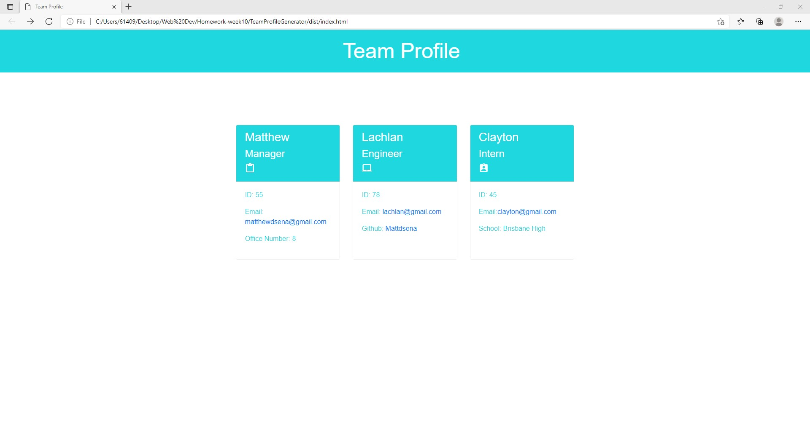
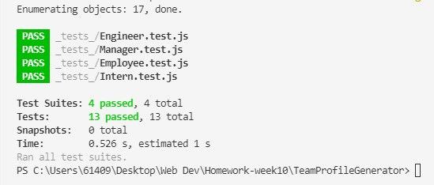

# Team Profile Generator 

## Description 
This application was created to generate a team profile based on user input using the Inquirer module from Node.js and displaying the information on a newly created html page with a style sheet. 
This project demonstrates use of OOP and TDD using Jest. 

## Installation 
The user should clone the repository from GitHub and download Node. This application also requires a file system and inquirer module. 
If testing is required, this application uses Jest. 

## Usage 
Use inquirer from your command line to answer questions about your project.

You can view my walk through video here - [Google Drive](https://drive.google.com/file/d/1mvkSvoJdy39QIz-OHLXUS4NbmObN39uD/view) 

## Tests
Run `npm test` to run Jest for tests on constructors, as seen below, the tests ran successfully.

Please note I added some styling to my page after my walk through video 

## Questions
If you have any questions about this projects, please contact me directly at matthewdsena@gmail.com. 
You can view more of my projects at https://github.com/Mattdsena.
